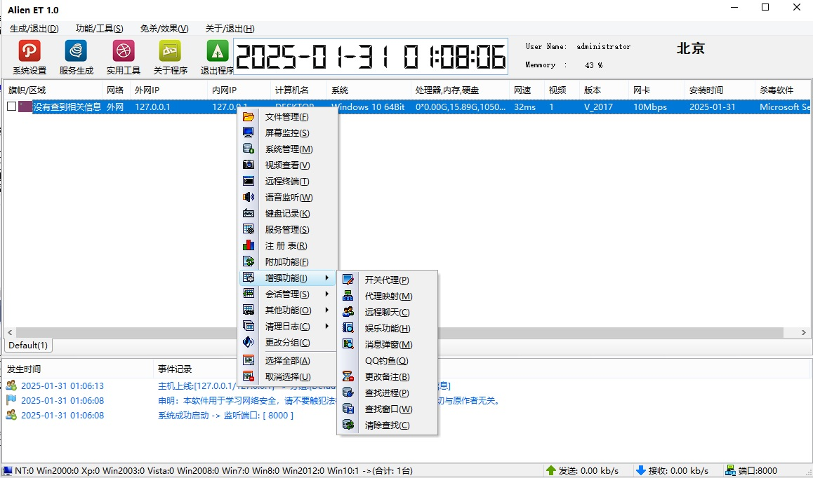
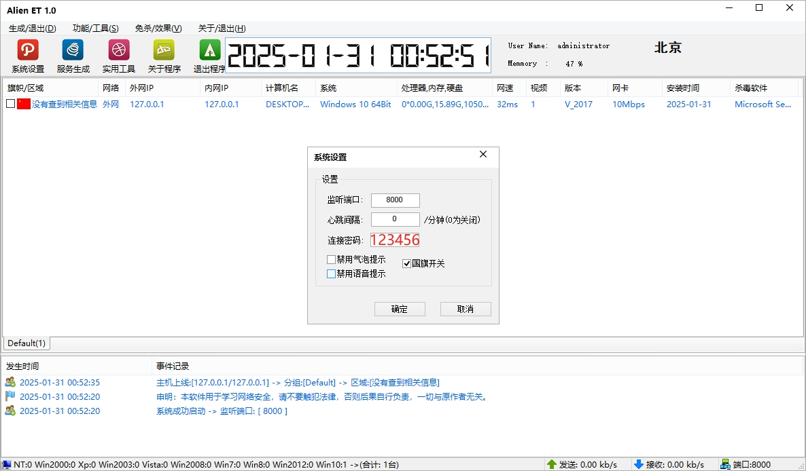
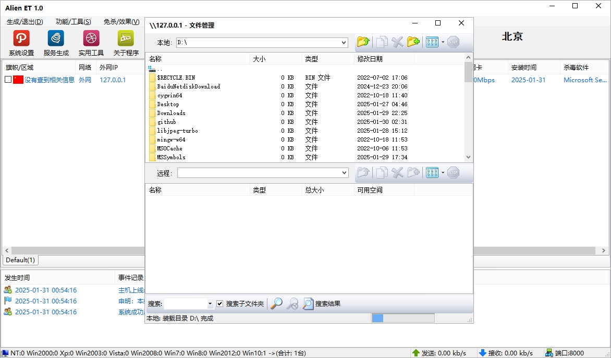
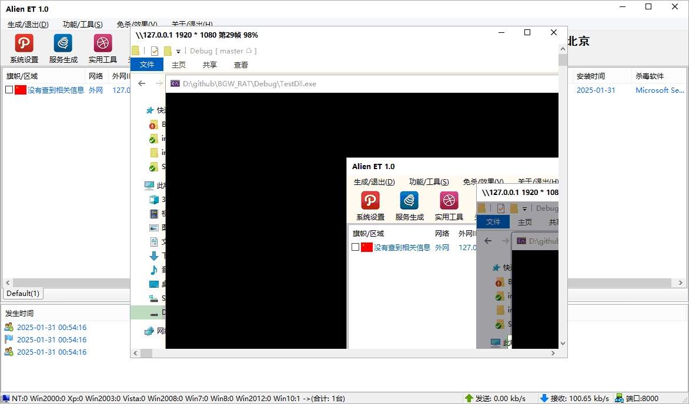
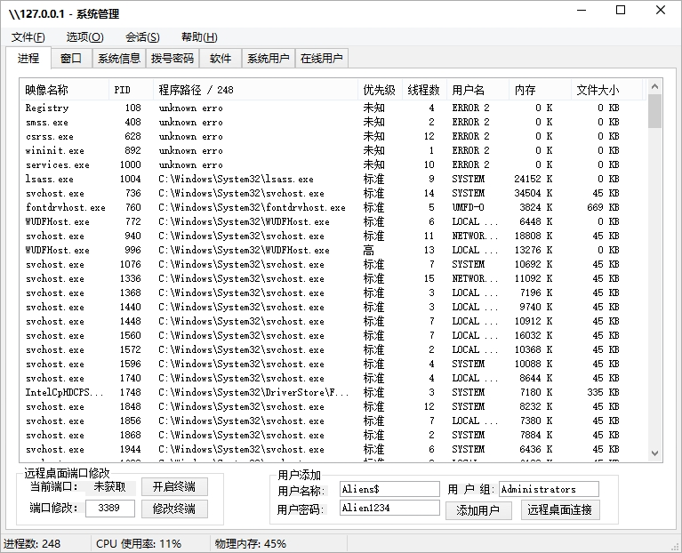
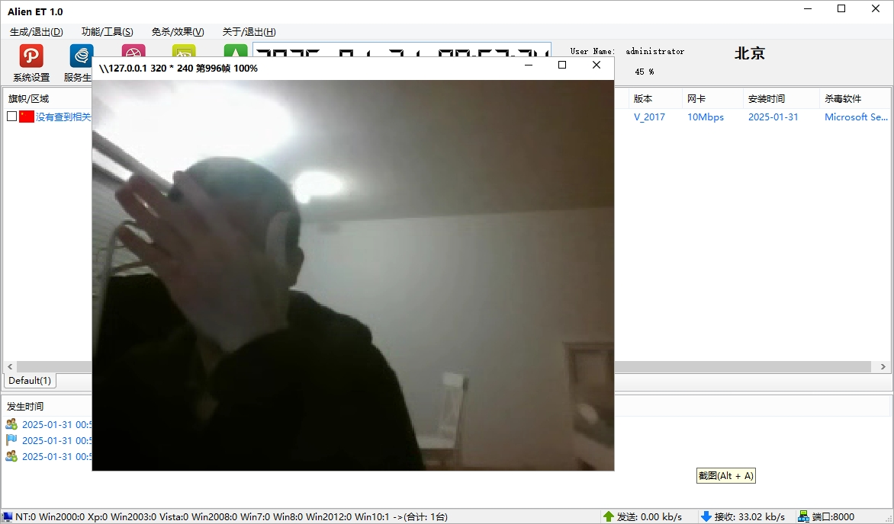
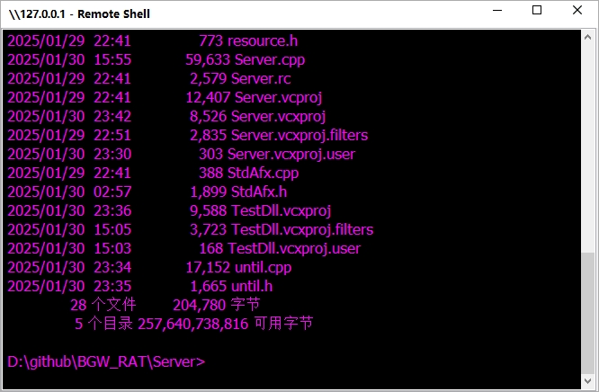
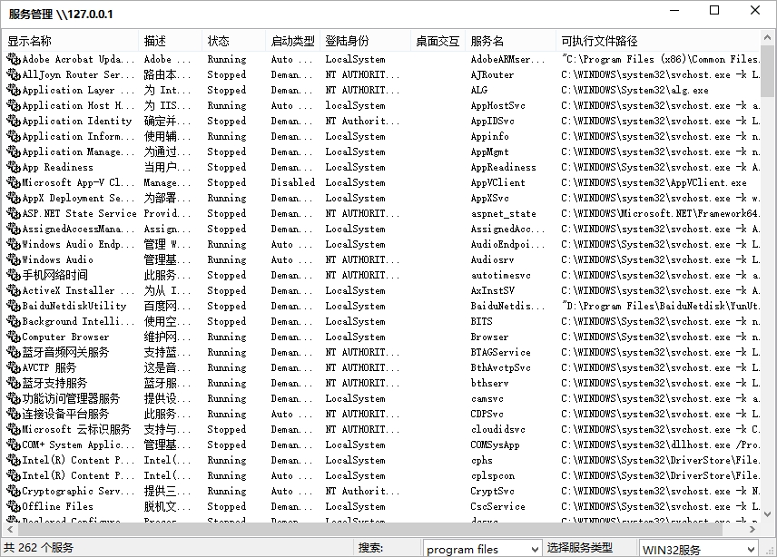
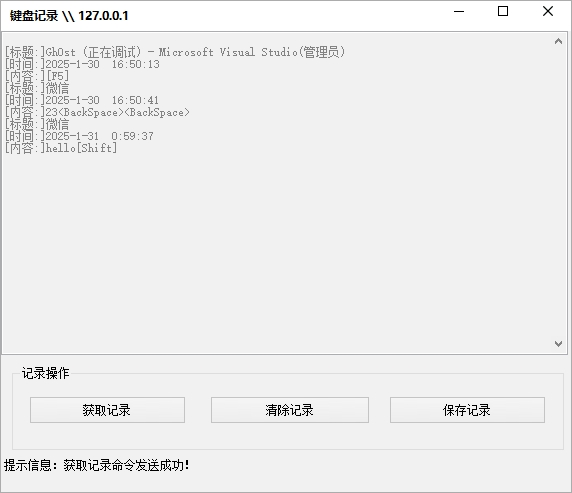

# 大灰狼远控程序

“大灰狼远程控制程序”通常是指一种被黑客或恶意软件用于远程控制用户计算机的恶意程序。
这类程序允许攻击者通过互联网或其他网络，远程访问和控制被感染的计算机，执行各种操作，
例如窃取个人信息、安装其他恶意软件、监控用户活动等。

这种类型的恶意软件通常会隐藏在受感染的文件或程序中，当用户不小心下载或运行时，
它会在后台悄无声息地运行。一旦安装，黑客可以通过远程连接操控受害者的电脑，进行数据窃取、
传播病毒或攻击其他目标等活动。

## 1. 推荐阅读

[【亲自指挥】手把手教你编译大灰狼远控程序](https://github.com/yuanyuanxiang/TechBlog/blob/master/%E8%BF%9C%E6%8E%A7%E7%A8%8B%E5%BA%8F/01.%E3%80%90%E4%BA%B2%E8%87%AA%E6%8C%87%E6%8C%A5%E3%80%91%E6%89%8B%E6%8A%8A%E6%89%8B%E6%95%99%E4%BD%A0%E7%BC%96%E8%AF%91%E5%A4%A7%E7%81%B0%E7%8B%BC%E8%BF%9C%E6%8E%A7%E7%A8%8B%E5%BA%8F.md)

按照上述文档的指导，您能自己亲自编译大灰狼远控程序源码。

## 2. 项目介绍

此项目的原始代码来自 *[Logkiss](https://github.com/Logkiss/Rat-winos4.0-gh0st)*。我在此表示感谢！

出于研究和学习之目的，我解决了大灰狼远控源码编译问题，并且将代码结构进行重新布局，清理了无关项目，
且将项目的IDE都升级为VS2019，统一由解决方案 `Gh0st.sln` 管理，在Debug和Release模式下都能编译通过。

| 编号  | 文件/文件夹 | 说明   |
|------|----|------|
| 1  | common | 通用库文件、头文件 |
| 2  | gh0st | 控制端程序 |
| 3  | images| 程序运行截图|
| 4  | Plugins | 插件DLL |
| 5  | Server | 主要DLL |
| 6  | third-party | 主程序依赖项|
| 7  | Gh0st.sln | 解决方案文件|

## 3. 调试方法

此项目可以使用 **Visual Studio 2019** 进行编译了。
程序运行界面如图所示。

首次运行Gh0st，需要设置密码，才能对受控设备进行操作。

将此项目进行编译后，启动 `Gh0st` 服务端，再启动 `TestDll` 测试项目，即可对该项目进行测试。
提示：您需要将 __third-party__ 目录中的2个文件拷贝到程序目录，以便程序正常运行。

从软件来看，大灰狼远控程序功能比较丰富，包括了文件管理、远程桌面、键盘记录、视频监控、语音监听等功能。

## 4. 变更记录

- **[2025/01/30]**

将代码结构进行重新布局，清理了无关项目，且将项目的IDE都升级为VS2019，统一由解决方案 `Gh0st.sln` 管理。

## 5. 免责声明

程序被报告病毒属于正常现象，请您自行编译程序。项目代码仅限于学习和交流用途。任何人使用该软件所造成的后果，
由其本人承担。
